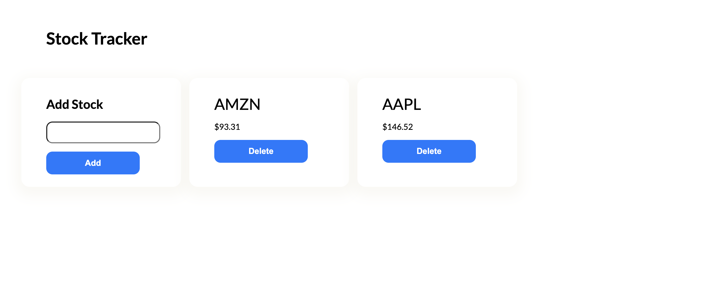

# Pool

This project was generated with [Angular CLI](https://github.com/angular/angular-cli) version 15.2.0.



This app should give anyone a good idea bout how I'd architect and develop an Angular app in one day. To see how I'd architect an Angular UI library, check out [ngfx](https://github.com/steveblue/ngfx). A robust example of how I'd architect a Web Component UI library in a monorepo can be found in [this repo](https://github.com/readymade-ui/fullstack-web-components/tree/chapter-10-solution), although that example could be updated to leverage Nx.

This app displays two stocks by default (AMZN & APPL). The user can add & delete stocks from the UI.

State management is handled with an Observable Store. Documentation about this pattern is found [here](https://dev.to/steveblue/redux-with-observable-stores-in-angular-1b3b).

The app has one route for displaying the stocks.

Three components are displayed: CardComponent, ButtonComponent, and InputComponent.

MarketService handles API calls to the Finnhub WebSocket Service.

New trades stream in as they are made, so if you want to see the app handle changes fast, add popular stocks.

I didn't add many tests, but there should at least be some minimal coverage with tests passing.

I included some documentation inline in src/app/shared/state/market/market.types.ts.

## IMPORTANT

To run the app, you'll need to generate an auth token for making requests to finnhub.io. Setting up an account is free and easy at https://finnhub.io. Click on the button "Get free API key", obtain the key, then create a new file named `token.ts` in the root directory. The contents of this file should look as follows, replacing `{{REPLACE_TOKEN_HERE}}` with the actual token:

```
export const tokens = {
  FINNHUB: '{{REPLACE_TOKEN_HERE}}',
};
```

## Development server

Run `ng serve` for a dev server. Navigate to `http://localhost:4200/`. The application will automatically reload if you change any of the source files.

## Code scaffolding

Run `ng generate component component-name` to generate a new component. You can also use `ng generate directive|pipe|service|class|guard|interface|enum|module`.

## Build

Run `ng build` to build the project. The build artifacts will be stored in the `dist/` directory.

## Running unit tests

Run `ng test` to execute the unit tests via [Karma](https://karma-runner.github.io).

## Running end-to-end tests

Run `ng e2e` to execute the end-to-end tests via a platform of your choice. To use this command, you need to first add a package that implements end-to-end testing capabilities.

## Further help

To get more help on the Angular CLI use `ng help` or go check out the [Angular CLI Overview and Command Reference](https://angular.io/cli) page.
